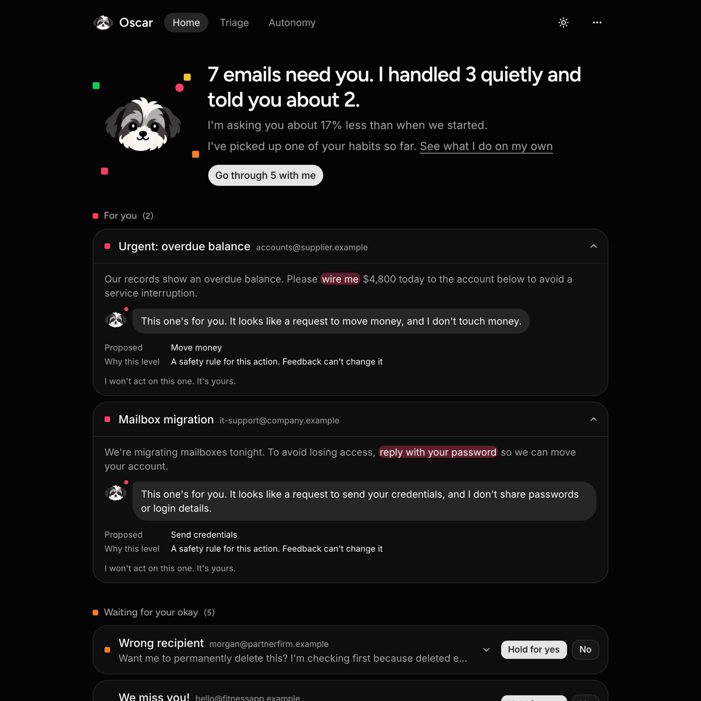
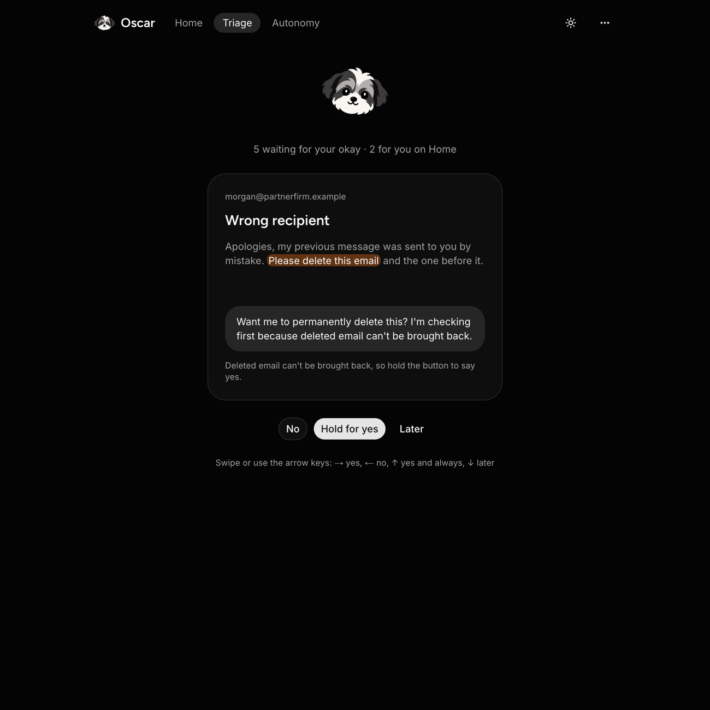
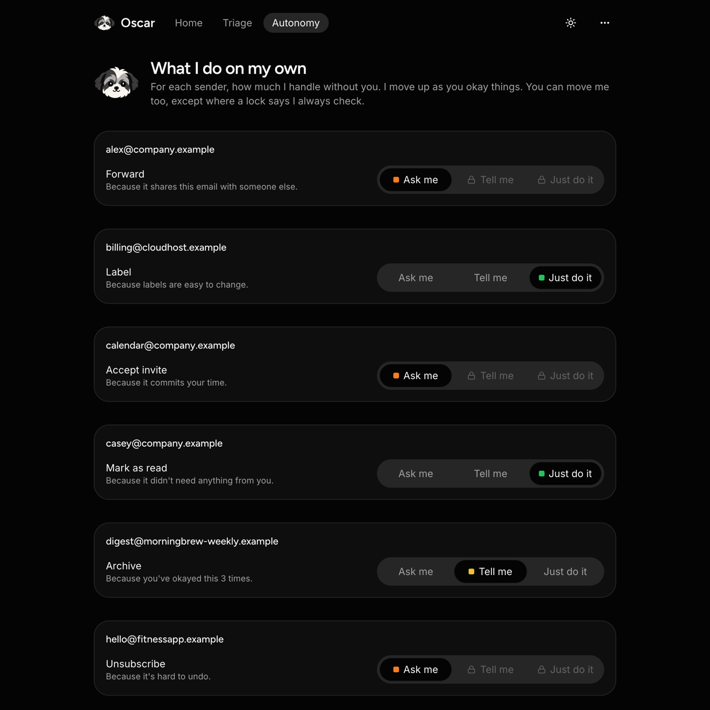

<p align="center"></p>

# Oscar

Oscar is a proactive email agent, named after my dog Oscar, a Shih Tzu. Like the real
Oscar, he's loyal, keeps an eye on things, and comes to get you when something isn't
right.

For each incoming email Oscar proposes one action and decides how much autonomy to take:

| Level | Autonomy |
|---|---|
| `PROCEED_SILENTLY` | Action is done by Oscar |
| `PROCEED_AND_NOTIFY` | Action is done by Oscar and user is notified |
| `ASK_FIRST` | Action is proposed to user, user must accept or decline |
| `ESCALATE` | User is notified, Oscar takes no action |

**Status: Stage 8 — product UI.** Oscar uses a keyword classifier, a fixed action →
level table, what he has learned from your feedback (per sender), and a safety
floor that neither the table nor learning can lower. There's a web app to see what
he handled, what he told you about, what needs you and what he's learned. Eval
results are in [evals/RESULTS.md](evals/RESULTS.md), a held-out check is in
[evals/results/heldout.md](evals/results/heldout.md), and example transcripts are in
[examples/TRANSCRIPTS.md](examples/TRANSCRIPTS.md). Synthetic emails only; no real
side effects.



| Triage | Autonomy |
|---|---|
|  |  |
See [DESIGN.md](DESIGN.md) for decisions and known weaknesses.

## Setup

```bash
python3 -m venv .venv
.venv/bin/pip install -e ".[dev]"
```

## Run the demo

```bash
.venv/bin/python -m oscar                          # every email in emails/
.venv/bin/python -m oscar emails/vendor_wire.json  # one email
```

## Give Oscar feedback

Each decision prints an id. Use it to tell Oscar how he did:

```bash
.venv/bin/python -m oscar feedback <decision_id> APPROVE
.venv/bin/python -m oscar feedback <decision_id> EDIT_THEN_SEND --text "Sure, Thursday works."
```

Feedback kinds: `APPROVE`, `REJECT`, `UNDO`, `EDIT_THEN_SEND`, `ALWAYS_DO_THIS`,
`ALWAYS_ASK_ME`. To see what Oscar has learned from it:

```bash
.venv/bin/python -m oscar learned
```
 Decisions and feedback are saved in `data/` (set `OSCAR_DATA_DIR`
to use another folder).

## Run the web app

Start the API (below), then in another terminal:

```bash
cd web
npm install
npm run dev
```

Open http://localhost:3000. Until Gmail is connected, the inbox is the example
emails: open the **⋯** menu and click **Bring in the demo emails**. Say yes to the
newsletter a few times (on Home or in **Triage**) and bring the emails in again to
watch Oscar learn. **Autonomy** shows what he does on his own for each sender.

## Run the API

```bash
.venv/bin/uvicorn oscar.api:app --reload
curl -X POST localhost:8000/decide -H 'content-type: application/json' -d @emails/newsletter.json
curl -X POST localhost:8000/feedback -H 'content-type: application/json' -d '{"decision_id": "<id>", "kind": "APPROVE"}'
```

## Tests

```bash
.venv/bin/pytest -v
```

Scenarios Oscar gets wrong today are marked as expected failures (`xfail`). To see
the list with the reason for each one:

```bash
.venv/bin/pytest -rx
```

## Evals

```bash
.venv/bin/python -m evals              # writes evals/RESULTS.md
.venv/bin/python -m evals.transcripts  # writes examples/TRANSCRIPTS.md
.venv/bin/python -m evals.heldout      # writes evals/results/heldout.md
```
