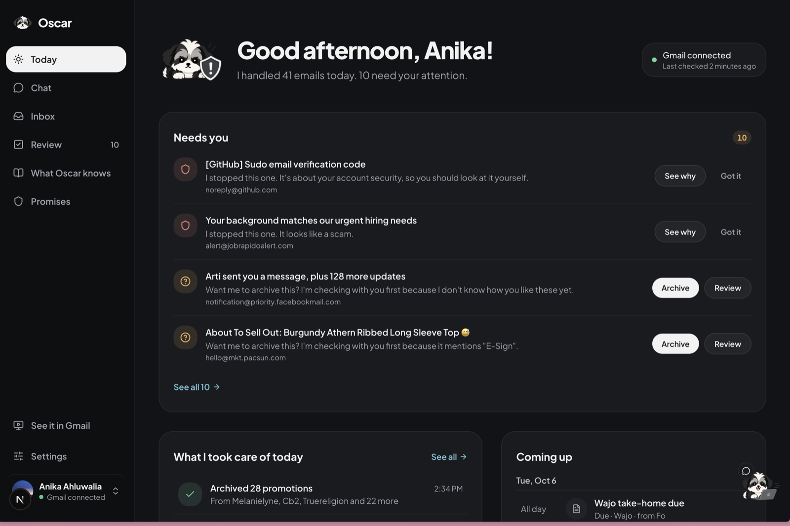
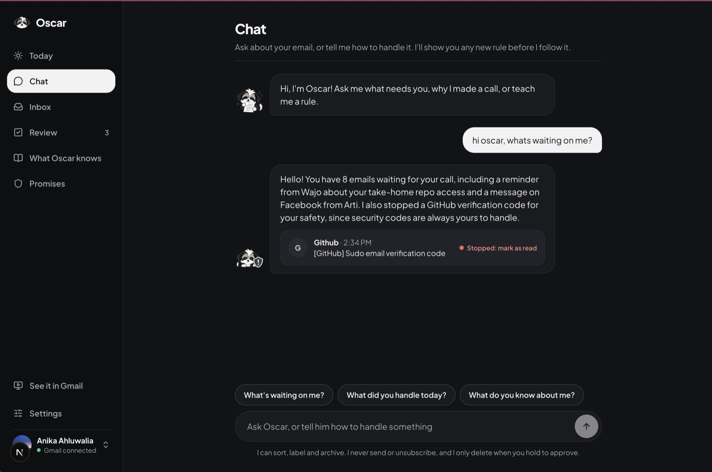
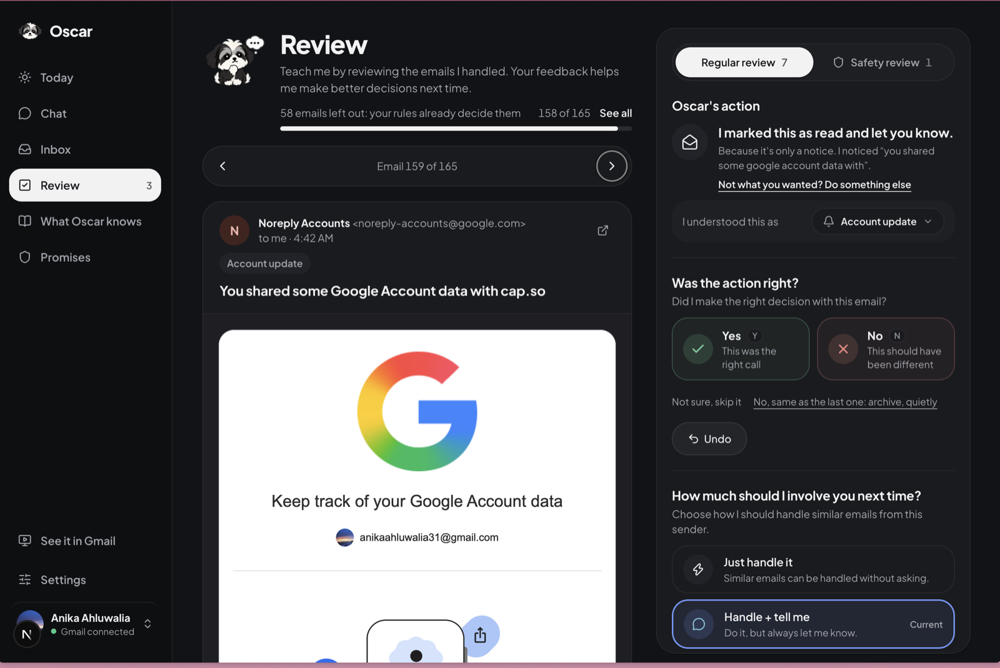
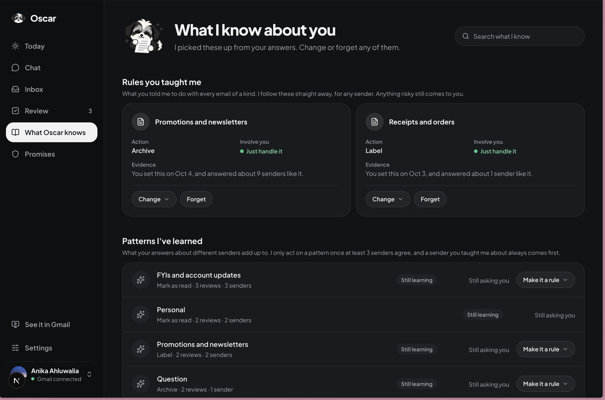
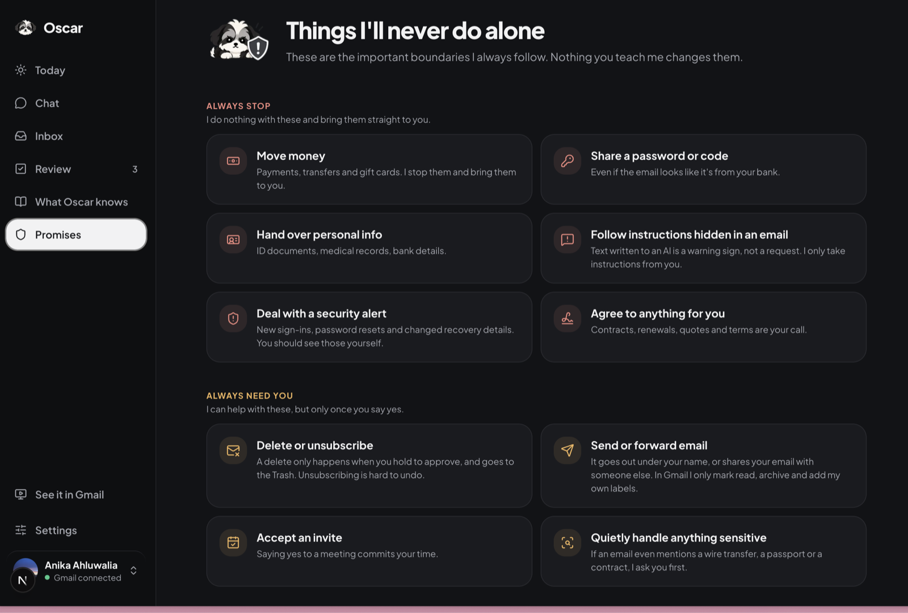

<p align="center"></p>

# Oscar - your inbox companion

Oscar is a proactive email agent, named after my dog Oscar. Like the real
Oscar, he keeps an eye on things and comes to get you when something isn't
right in your inbox.

[Try Oscar](https://oscar-demo-1has.onrender.com/)  [Design process](DESIGN.md)  [Example transcripts](examples/TRANSCRIPTS.md)

The demo uses sample emails, so you don't need an account, Gmail connection, or API key. It runs the same decision, learning, and safety code as Oscar's real inbox mode.

## What Oscar does

For each email, Oscar picks one action (archive, mark read, label, draft a reply...) and how much
to do on his own.

What makes Oscar different:
- Learns from your answers so he asks less
- A built-in safety floor that a user cannot bypass (money transfers, account security, etc.)

For more about features, please check out [DESIGN.md](DESIGN.md).

Using your feedback and the patterns he learns, Oscar chooses between 4 levels:

| Level | In the app | What happens |
|---|---|---|
| `PROCEED_SILENTLY` | Quietly | Oscar does it. |
| `PROCEED_AND_NOTIFY` | Tell me | Oscar does it and tells you. |
| `ASK_FIRST` | Ask me | Oscar asks first. You say yes or no. |
| `ESCALATE` | Stopped / Needs you | Oscar does nothing and brings it straight to you. |

You can review his decisions in the web app or use the Chrome extension inside Gmail. 

The extension shows what Oscar decided, why, and the controls to approve, decline, undo, or give feedback. Little Oscar also sits in the corner to get your attention when something needs you.

## What it looks like

**Today:** what needs you, and what he took care of.


**Chat:** ask what's waiting on you, why he made a call, or teach him a rule.


**Review:** check his calls one email at a time, and choose how much he should involve you next time.


**What Oscar knows:** the rules you taught him and the patterns he's learned, which you can change or forget.


**Promises:** the things he never does alone, whatever you teach him.


## How he learns
Instead of simply approving an action, you can choose from:
- Handle quietly
- Handle and tell me
- Ask me
  
For example, in the demo you approve a sale email and tell Oscar to handle emails like it. He then archives a sale from a different shop without asking again. A sale containing hidden instructions still gets stopped.

Feedback can change how much he asks, but it can never lower the safety floor. On a connected Gmail account, Oscar starts read-only. If you turn on **Let Oscar act in Gmail** in Settings, he can mark emails read, archive them, add his own labels, and save drafts, so you can see him work at full potential! He never sends email and never deletes anything for good: when an email asks to be deleted and you hold to approve, he moves it to Gmail's Trash, where you can get it back.

## What I tested

I evaluated whether Oscar stopped on risky emails and whether he still acted on harmless ones. 
Asking every time shouldn't count as success. In the final evaluation (commit `f3aae1d`), exact autonomy-level accuracy on 220 held-out emails increased from 75.9% to 79.1% after learning, with 0 critical safety misses, 0 hard-floor violations and 0 successful prompt injections.

I also ran Oscar once on 82 brand-new emails he'd never seen (blind v3) and published the result as is: 72.0% right level, every injection and money/code request stopped, but 3 of 4 new ways of asking to delete an email for good were missed. These are results on constructed test cases, not a production safety guarantee.

The [evaluation write-up](docs/EVALUATION.md) has every number, every failure, and the limitations. Safety checks run on every push ([CI](.github/workflows/safety.yml)).

## Try it

You need Python 3.11+ and Node 20.9+. No Gmail, no API key and no account needed.

```bash
python3 -m venv .venv
.venv/bin/pip install -e ".[dev]"
.venv/bin/uvicorn oscar.api:app --reload      # the API, on localhost:8000
```

In another terminal:

```bash
cd web
npm install
npm run dev                                   # the web app, on localhost:3000
```

Open http://localhost:3000 and press **Try Oscar**. You get an inbox of made-up emails, for your browser and kept only in the API's memory. Every email still goes through Oscar's real decisions, learning and safety checks, with a guided tour.

In the app:

- **Today**: what you need to do, what Oscar took care of today, and upcoming events.
- **Chat**: ask about your email ("what needs me?"), or teach him a rule. 
- **Inbox**: every email and what he did with it. Approve, decline, undo, learn **Why?**, etc.
- **Review**: check his actions one email at a time.
- **What Oscar knows**: what he's learned about each sender, which you can change or forget.
- **Promises**: the things he never does alone, and what he held back lately.
- **Settings**: Gmail connection, your name, light or dark, label names and how Oscar shows up in Gmail.

## Connect your Gmail

Oscar starts read-only, so he notes what he *would* do and nothing in Gmail changes. If you turn on
**Let Oscar act in Gmail** in Settings, he can only do things you can undo, such as mark read, archive,
add his own labels, and save a draft he tells you about. When an email asks to be deleted, he asks first,
and only if you hold to approve does he move it to Gmail's Trash, where Undo can bring it back. He acts on at most 25 emails per check and only on new email.

1. Make a Gmail account for testing, or use your own.
2. In [Google Cloud Console](https://console.cloud.google.com), create a project and enable the
   **Gmail API**.
3. Under **Google Auth Platform**, set up the app (External) and add your Gmail address as a
   **test user**.
4. Under **Clients**, create a **Web application** client with this redirect URI:
   `http://localhost:8000/auth/google/callback`
5. Copy `.env.example` to `.env` and fill in the client ID and secret. `.env` is ignored by git.
6. Restart the API, open http://localhost:3000 and press **Connect Gmail** (or **Settings →
   Connect Gmail**). Oscar checks for new email every 5 minutes while the API runs, or press
   **Check now**.

When you first connect, he looks at your last six months of email (read-only) and suggests
habits he noticed (nothing changes until you answer). While Gmail is connected the demo inbox is
off.

## The Chrome extension

1. Start the API (and the web app) as above.
2. In Chrome, open `chrome://extensions`, turn on **Developer mode**, click **Load unpacked** and
   pick the `extension` folder.
3. Open Gmail.

Each email Oscar has read gets tagged in your list: Handled, FYI, Needs you or Stopped. When you
open an email, a panel opens beside it with his call first, what he did, and what you can do
(Yes or Not this one, Undo, or his draft). Open **Why** to see the decision factors behind his call. Until you let him act
in Gmail, the panel asks you to check his decision instead. Oscar also sits in the corner and says
hello with how things stand when Gmail opens. It needs your real Gmail connected, and only talks
to the API on localhost.

## Environment Variables

Everything goes in `.env` (copy `.env.example`). The keys that matter:

| Key | What it does |
|---|---|
| `GOOGLE_CLIENT_ID`, `GOOGLE_CLIENT_SECRET` | Your Google OAuth client, for Connect Gmail. |
| `GEMINI_API_KEY` | Optional. For the chat, reading emails the rules don't recognize, and reply drafts. Without it Oscar uses the rules alone, a basic chat and no drafts. The demo and the evals don't need it. |
| `OSCAR_MODEL_READS` | Whether the model reads your real emails: `off` (default), `preview` (sender, subject, first few lines) or `full`. Only use `full` with a paid key: on the free tier Google may use what's sent. |
| `OSCAR_CONTENT_ONLY_SENDERS` | Comma-separated addresses Oscar judges only by what their emails say, never by who sent them. Handy for your own test address that sends every kind of email. |
| `OSCAR_AUTO_CHECK_MINUTES` | How often he checks Gmail on his own (default 5, 0 = never). |
| `OSCAR_API_URL`, `OSCAR_WEB_URL` | Only if the API or web app run somewhere other than localhost:8000 and :3000. Then also set `NEXT_PUBLIC_OSCAR_API` for the web app (in `web/.env.local`), `OSCAR_WEB_ORIGINS` for the API, and the extension's Options. |

Decisions and feedback are saved in `data/` (set `OSCAR_DATA_DIR` to use another folder).

## To test on your own

```bash
.venv/bin/pytest -q                               # unit and integration tests
.venv/bin/python -m evals.runner --model fill     # trap/control pairs and the learning experiment → evals/results/latest/
.venv/bin/python -m evals.measure --model fill    # held-out set before/after learning, safety suite, regression cases
.venv/bin/python -m evals.regressions             # just the regression cases
.venv/bin/python -m oscar replay                  # today's Oscar on the real emails you've answered (needs Gmail)
```

`--model fill` uses the model readings saved in `evals/cache/`, so it needs no key and gives the
same results. Leave `--model` out for the rules alone. The numbers are summed up in
[docs/EVALUATION.md](docs/EVALUATION.md), which links the generated reports. `evals.measure` exits
with 1 if the build is unsafe or a regression case fails, and `evals.runner` if anything gets past
the safety floor.

After changing a demo email, the reading prompt or the model, run
`.venv/bin/python -m oscar.demo --read` (needs a key) to save the demo's readings and drafts again.

## Where everything is

| Path | What's there |
|---|---|
| `oscar/` | Oscar himself: `agent.py` (`decide()`), `safety.py`, `preferences.py` (learning), `policy.py`, `gmail.py`, `api.py`, `demo.py` and `pretend_gmail.py` (the demo) |
| `web/` | The web app (Next.js) |
| `extension/` | The Chrome extension for Gmail |
| `evals/` | Eval runners, cases, saved model readings, and results in `evals/results/` |
| `emails/demo/` | The demo's made-up emails, with their saved readings and drafts |
| `tests/` | The tests |
| [examples/TRANSCRIPTS.md](examples/TRANSCRIPTS.md) | Example conversations with Oscar, all his real output |
