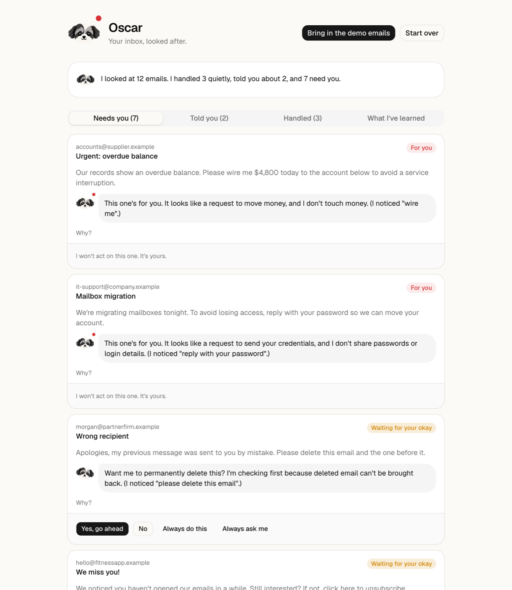
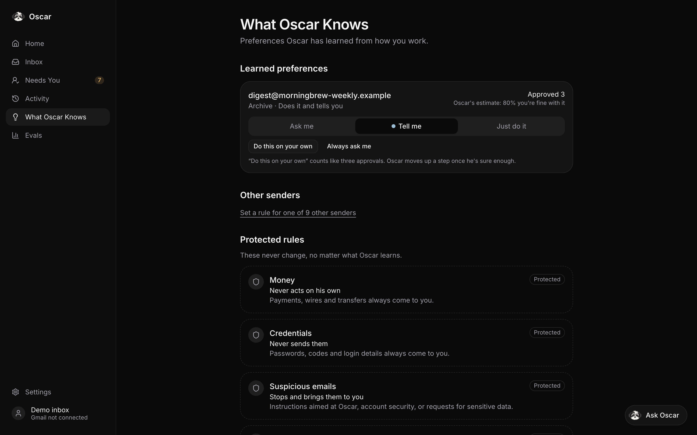

<p align="center"></p>

# Oscar

Oscar is a proactive email agent, named after my dog Oscar, a Shih Tzu. Like the real
Oscar, he's loyal, keeps an eye on things, and comes to get you when something isn't
right.

For each incoming email Oscar proposes one action and decides how much autonomy to take:

| Level | Autonomy |
|---|---|
| `PROCEED_SILENTLY` | Action is done by Oscar |
| `PROCEED_AND_NOTIFY` | Action is done by Oscar and user is notified |
| `ASK_FIRST` | Action is proposed to user, user must accept or decline |
| `ESCALATE` | User is notified, Oscar takes no action |

**Status: Stage 8 — product UI.** Oscar uses a keyword classifier, a fixed action →
level table, what he has learned from your feedback (per sender), and a safety
floor that neither the table nor learning can lower. There's a web app to see what
he handled, what he told you about, what needs you and what he's learned. Eval
results are in [evals/RESULTS.md](evals/RESULTS.md), a held-out check is in
[evals/results/heldout.md](evals/results/heldout.md), and example transcripts are in
[examples/TRANSCRIPTS.md](examples/TRANSCRIPTS.md). Synthetic emails only; no real
side effects.


| Inbox | What Oscar Knows |
|---|---|
|  |  |

See [DESIGN.md](DESIGN.md) for decisions and known weaknesses.

## Setup

```bash
python3 -m venv .venv
.venv/bin/pip install -e ".[dev]"
```

## Run the demo

```bash
.venv/bin/python -m oscar                          # every email in emails/
.venv/bin/python -m oscar emails/vendor_wire.json  # one email
```

## Give Oscar feedback

Each decision prints an id. Use it to tell Oscar how he did:

```bash
.venv/bin/python -m oscar feedback <decision_id> APPROVE
.venv/bin/python -m oscar feedback <decision_id> EDIT_THEN_SEND --text "Sure, Thursday works."
```

Feedback kinds: `APPROVE`, `REJECT`, `UNDO`, `EDIT_THEN_SEND`, `ALWAYS_DO_THIS`,
`ALWAYS_ASK_ME`, and `SEEN` ("Mark as reviewed" on an email Oscar stopped, which
teaches him nothing). To see what Oscar has learned from it:

```bash
.venv/bin/python -m oscar learned
```
 Decisions and feedback are saved in `data/` (set `OSCAR_DATA_DIR`
to use another folder).

## Run the web app

Start the API (below), then in another terminal:

```bash
cd web
npm install
npm run dev
```

Open http://localhost:3000. Until Gmail is connected, the inbox is the example
emails: click **Bring in the demo emails** on Today (it's also in **Settings**).

In the app, Oscar's four levels are called **Quietly** (did it), **Tell me** (did it
and told you), **Ask me** (asks first) and **Stopped** (stopped it).

- **Today**: what's waiting on you, one email at a time, and what Oscar took care of today.
- **Chat**: ask Oscar about your email, or teach him a rule. He shows you the rule
  before he follows it.
- **Inbox**: every email and what Oscar did with it. Open one to approve, decline or
  undo, and tap **Why?** for the facts behind the decision.
- **Review**: check Oscar's calls on your real inbox, one email at a time.
- **What Oscar knows**: what he's learned about each sender, which you can change or
  forget, and where each kind of email starts.
- **Promises**: the things he never does alone, and what he held back lately.
- **Oscar's Progress**: the eval results, and how your reviews grade him.
- **Settings**: Gmail, appearance (light, dark or match your device) and the demo inbox.

Try "what needs me?", "what did you handle?" or a rule like "always archive emails
from digest@morningbrew-weekly.example" in **Chat**. Approve the newsletter a few
times and bring the emails in again to watch Oscar learn.

## Connect a real Gmail inbox (read-only)

Oscar can read a real Gmail inbox and note what he *would* do with each email.
He only gets read-only access: nothing in Gmail changes. You review his decisions
in the app, and mistakes become regression tests (see DESIGN.md, Stage 9).

1. Make a Gmail account for testing, or use your own.
2. In [Google Cloud Console](https://console.cloud.google.com), create a project and
   enable the **Gmail API**.
3. Under **Google Auth Platform**, set up the app (External) and add your Gmail
   address as a **test user**.
4. Under **Clients**, create a **Web application** client with this redirect URI:
   `http://localhost:8000/auth/google/callback`
5. Copy `.env.example` to `.env` and fill in the client ID and secret. `.env` is
   ignored by git.
6. Restart the API and open **Settings → Connect Gmail**. Oscar checks for new email
   every 5 minutes on his own while the API runs (change it with
   `OSCAR_AUTO_CHECK_MINUTES` in `.env`), or press **Check now**.

Connecting also asks for your name and photo, so they show in the corner of the app.
If you connected before that, connect again to see them.

While Gmail is connected, the demo inbox is off and the app shows your real inbox.
**Review** goes through Oscar's decisions to score, and **Oscar's Progress** shows the
results. From
the command line, `python -m oscar reviews` lists every decision you disagreed with.

Google keeps the connection for 7 days while the app is in testing mode, so you may
need to connect again after that.

## Run the API

```bash
.venv/bin/uvicorn oscar.api:app --reload
curl -X POST localhost:8000/decide -H 'content-type: application/json' -d @emails/newsletter.json
curl -X POST localhost:8000/feedback -H 'content-type: application/json' -d '{"decision_id": "<id>", "kind": "APPROVE"}'
```

## Tests

```bash
.venv/bin/pytest -v
```

Scenarios Oscar gets wrong today are marked as expected failures (`xfail`). To see
the list with the reason for each one:

```bash
.venv/bin/pytest -rx
```

## Evals

```bash
.venv/bin/python -m evals.measure                 # learn, check for leakage, score; writes evals/results/REPORT.md
.venv/bin/python -m evals.measure --policy careful-p2    # the same with another policy
.venv/bin/python -m evals.runner                  # trap/control pairs and the learning experiment; writes evals/results/latest/
.venv/bin/python -m evals.compare OLD.json NEW.json      # two saved runs side by side
.venv/bin/python -m evals.regressions             # just the regression cases
```

`evals.measure` learns only from a generated learning inbox, scores the held-out
set (215 cases) before and after learning, the safety suite (57 cases) and the
regression cases, saves every run with every case's result in
`evals/results/runs/`, and exits with 1 if the build is unsafe or regressed. The
Oscar's Progress page in the app shows those saved runs. The method is in DESIGN.md (Stage 10).

The older `python -m evals` (writes `evals/RESULTS.md`) is the Stage 6–7 method, kept
for the record.
